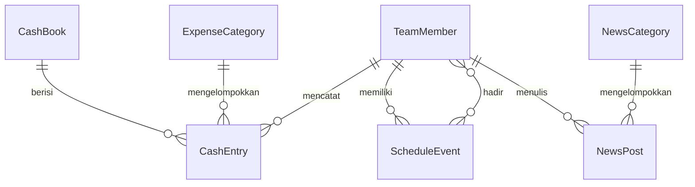

# PRD Web Profile Company Astrum Deus + CMS

## Status dokumen

Draft awal. Struktur section sudah final, tapi sebagian isi masih menunggu tambahan dari Grace.

Penanda yang dipakai di dokumen ini:

- `TBD (Grace)` berarti belum diputuskan dan sengaja tidak diisi.
- `Asumsi` berarti usulan default dari agent yang boleh langsung ditimpa.

Yang masih `TBD (Grace)`:

- Profil dan brand Astrum Deus (bidang usaha, audience, tone)
- Stack dan pilihan CMS
- Isi tiap section Home, kategori News, isi Media Kit, kriteria Partners, kanal Contact
- Kategori pengeluaran dan daftar anggota tim

## Ringkasan

Astrum Deus butuh satu web profile perusahaan yang isinya bisa dikelola sendiri lewat CMS, tanpa minta developer setiap kali ada perubahan konten. Di sisi lain, tim juga butuh area internal untuk mengatur jadwal dan mencatat keuangan operasional, sehingga satu aplikasi melayani dua audience: publik dan tim internal.

Profil perusahaan, bidang usaha, target audience dan positioning brand: `TBD (Grace)`.

## Tujuan

1. Semua konten di menu audience bisa dibuat, diubah dan dihapus dari CMS oleh non-developer.
2. Menu opsional bisa dinyalakan dan dimatikan tanpa deploy ulang.
3. Jadwal tim tercatat di satu kalender yang jadi rujukan bersama.
4. Setiap transaksi kas operasional dan kas tim tercatat, dan laporan harian serta bulanan dihasilkan dari data yang sama.

## Non-goals

Di luar scope rilis pertama:

- E-commerce, keranjang belanja dan pembayaran online
- Multi-tenant atau multi-perusahaan dalam satu instance
- Payroll, pajak dan akuntansi jurnal umum berpasangan
- Aplikasi mobile native
- Portal login untuk pelanggan atau partner

## Peran dan akses

Lima peran yang dipakai:

- **Visitor**: publik, tanpa login. Hanya melihat halaman audience yang aktif.
- **Editor**: login CMS. CRUD konten audience, tapi tidak bisa mengubah toggle menu dan tidak bisa masuk area internal.
- **Admin**: login CMS. Semua akses Editor, ditambah pengaturan menu Y/N, pengaturan situs dan manajemen user.
- **Team Member**: login area internal. Melihat kalender tim, membuat dan mengubah event miliknya, serta mencatat entri kas tim.
- **Finance**: login area internal. CRUD entri kas operasional dan kas tim, plus akses penuh ke laporan keuangan.

Matriks akses per modul:

- Home, News, Media Kit, Partners: baca untuk Visitor bila aktif, CRUD untuk Editor dan Admin
- Toggle menu dan pengaturan situs: Admin saja
- Contact: kirim pesan untuk Visitor, baca dan kelola pesan untuk Editor dan Admin
- Schedule Team: baca untuk semua peran internal, tulis untuk Team Member pada event miliknya, tulis penuh untuk Admin
- Cash book operasional: tulis untuk Finance, baca untuk Admin
- Cash book tim: tulis untuk Team Member pada entri miliknya, tulis penuh untuk Finance
- Financial Reporting: baca untuk Finance dan Admin

`Asumsi`: satu orang boleh punya lebih dari satu peran, misalnya Admin yang sekaligus Finance.

## Aturan menu audience

Menu audience terdiri dari lima item, dengan dua status berbeda:

| Menu | Status | Bisa dimatikan |
| --- | --- | --- |
| Home | Mandatory | Tidak |
| News | Mandatory | Tidak |
| Media Kit | Use Y/N | Ya |
| Partners | Use Y/N | Ya |
| Contact | Mandatory | Tidak |

Menu mandatory selalu tampil di navigasi. Yang bisa diubah hanya kontennya lewat CMS, bukan keberadaannya, sehingga toggle-nya tidak ditampilkan atau ditampilkan dalam keadaan terkunci.

Menu Use Y/N punya flag `is_enabled` yang dikontrol Admin. Perilaku saat flag mati:

- Item hilang dari navigasi utama dan dari footer
- Route halamannya membalas 404, bukan halaman kosong atau redirect
- Halamannya keluar dari sitemap
- Kontennya tetap tersimpan, jadi menyalakan ulang tidak perlu input ulang

Perubahan flag berlaku tanpa deploy ulang. Kalau pakai static generation, halaman navigasi direvalidasi saat flag berubah.

## Modul audience

### Home

Halaman utama tersusun dari section yang bisa diatur urutannya lewat CMS. Editor bisa menambah, mengubah urutan, menyembunyikan dan menghapus section.

Daftar section yang dibutuhkan: `TBD (Grace)`. `Asumsi` sebagai titik awal: hero, tentang singkat, layanan, sorotan berita dan CTA ke Contact.

Acceptance criteria:

- Editor mengubah urutan section, dan urutan di halaman publik ikut berubah tanpa deploy
- Section berstatus draft tidak tampil ke Visitor
- Home tetap tampil utuh saat Media Kit dan Partners dimatikan

### News

Daftar artikel dengan halaman detail per artikel.

Kebutuhan:

- CRUD artikel dengan judul, slug, ringkasan, isi rich text, cover, kategori, penulis dan tanggal publish
- Status draft dan published, plus jadwal publish di masa depan
- Daftar artikel dengan pagination, urut terbaru dulu
- Filter per kategori
- Slug unik dan stabil setelah artikel terbit

Daftar kategori awal: `TBD (Grace)`.

Acceptance criteria:

- Artikel draft tidak bisa diakses Visitor lewat URL langsung
- Artikel dengan jadwal publish besok belum tampil hari ini, dan tampil otomatis saat waktunya tiba
- Mengubah judul artikel yang sudah terbit tidak mengubah slug-nya kecuali Editor mengubah slug secara sadar

### Media Kit

Kumpulan aset brand yang bisa diunduh publik, aktif hanya bila flag `is_enabled` menyala.

Kebutuhan:

- CRUD aset dengan nama, deskripsi singkat, jenis file, ukuran dan file unduhan
- Pengelompokan aset, misalnya logo, warna dan foto
- Unduh satu file, dan `Asumsi` unduh seluruh grup sebagai zip

Isi media kit yang sebenarnya: `TBD (Grace)`.

Acceptance criteria:

- Saat flag mati, `/media-kit` membalas 404 dan menu tidak muncul
- Ukuran dan jenis file tampil sebelum Visitor mengunduh
- File yang dihapus dari CMS tidak lagi bisa diunduh lewat URL lama

### Partners

Daftar partner atau klien, aktif hanya bila flag `is_enabled` menyala.

Kebutuhan:

- CRUD partner dengan nama, logo, deskripsi singkat, tautan situs dan urutan tampil
- Pengelompokan partner, `Asumsi` berdasarkan jenis kerja sama
- Logo tampil rapi walau rasio aslinya berbeda

Kriteria dan pengelompokan partner: `TBD (Grace)`.

Acceptance criteria:

- Saat flag mati, `/partners` membalas 404 dan menu tidak muncul
- Urutan partner mengikuti field urutan, bukan urutan input
- Partner tanpa tautan situs tampil sebagai elemen non-klik, bukan tautan mati

### Contact

Halaman kontak dengan form dan informasi perusahaan.

Kebutuhan:

- Form dengan nama, email, subjek dan pesan, plus validasi di server
- Proteksi spam, `Asumsi` honeypot ditambah rate limit per IP
- Pesan tersimpan di database dan bisa dibaca Editor serta Admin, dengan status baru, dibaca dan selesai
- Notifikasi email ke alamat tujuan saat ada pesan masuk
- Informasi statis yang bisa diedit dari CMS: alamat, email, telepon dan tautan media sosial

Kanal kontak dan alamat tujuan notifikasi: `TBD (Grace)`.

Acceptance criteria:

- Pengiriman gagal menampilkan pesan error per field, dan isi form tidak hilang
- Pengiriman berhasil menyimpan satu record dan mengirim satu notifikasi
- Pesan yang sama terkirim dua kali dalam waktu singkat tertahan rate limit

## Modul internal

Area internal berada di belakang login dan tidak terindeks mesin pencari.

### Schedule Team

Kalender bersama untuk jadwal tim.

Kebutuhan:

- Tampilan bulanan dan mingguan, `Asumsi` bulanan sebagai default
- CRUD event dengan judul, tanggal, jam mulai, jam selesai, lokasi, catatan dan penanggung jawab
- Event bisa punya lebih dari satu anggota tim
- Event sepanjang hari tanpa jam mulai dan jam selesai
- Filter per anggota tim, plus tampilan "jadwal saya"
- Peringatan saat jadwal seorang anggota bertumpuk, sifatnya memberi tahu dan tidak memblokir simpan
- `Asumsi` event berulang ditunda ke iterasi berikutnya

Daftar anggota tim dan pola jadwal yang biasa dipakai: `TBD (Grace)`.

Acceptance criteria:

- Membuat event dua jam menampilkannya di slot yang benar pada tampilan mingguan
- Jam selesai lebih awal dari jam mulai ditolak dengan pesan yang jelas
- Menambahkan anggota ke event yang jamnya bertumpuk menampilkan peringatan, dan event tetap bisa disimpan
- Team Member tidak bisa mengubah event yang bukan miliknya

### Financial Record-keeping

Pencatatan kas dengan dua buku terpisah: kas operasional dan kas tim.

Kebutuhan:

- Dua cash book berdiri sendiri, masing-masing punya saldo awal dan saldo berjalan
- Entri kas dengan tanggal, jenis masuk atau keluar, nominal, kategori, keterangan, lampiran bukti dan pencatat
- Saldo berjalan dihitung dari entri, bukan disimpan sebagai angka yang bisa diedit langsung
- Kategori pengeluaran dan penerimaan bisa dikelola sendiri
- Koreksi dilakukan lewat entri pembalik, dan entri lama ditandai dikoreksi, bukan dihapus dari riwayat
- Lampiran bukti berupa gambar atau PDF
- Audit trail: siapa membuat, siapa terakhir mengubah dan kapan

Daftar kategori dan saldo awal tiap buku: `TBD (Grace)`.

Acceptance criteria:

- Entri masuk 500.000 pada buku operasional menaikkan saldo buku itu sebesar 500.000, dan saldo kas tim tidak berubah
- Nominal nol atau negatif ditolak
- Entri yang dikoreksi tetap terlihat di riwayat bersama entri pembaliknya
- Team Member tidak bisa membuat entri di kas operasional

### Financial Reporting

Laporan yang dihitung dari entri cash book, sehingga tidak ada input angka terpisah.

Kebutuhan:

- Laporan harian: saldo awal hari, total masuk, total keluar, saldo akhir dan rincian entri
- Laporan bulanan: rekap per kategori, total masuk, total keluar, saldo awal bulan dan saldo akhir bulan
- Pilihan lingkup laporan: kas operasional, kas tim atau gabungan keduanya
- Ekspor ke CSV, `Asumsi` PDF menyusul setelah CSV jalan
- Angka laporan selalu cocok dengan jumlah entri di periode yang sama

Format laporan yang biasa dipakai dan kebutuhan approval: `TBD (Grace)`.

Acceptance criteria:

- Saldo akhir laporan harian sama dengan saldo awal laporan hari berikutnya
- Total masuk dikurangi total keluar pada laporan bulanan sama dengan selisih saldo awal dan saldo akhir bulan
- Laporan gabungan sama dengan jumlah laporan kas operasional dan kas tim
- Entri yang dikoreksi tidak dihitung dua kali

## Content model

Ditulis sebagai entitas dan field, bukan skema database atau schema CMS tertentu, karena stack belum dipilih. Setiap entitas diasumsikan punya `id`, `created_at` dan `updated_at`.

- **SiteSetting**: `site_name`, `logo`, `favicon`, `default_meta_title`, `default_meta_description`, `contact_address`, `contact_email`, `contact_phone`, `social_links`
- **MenuItem**: `key`, `label`, `path`, `is_mandatory`, `is_enabled`, `order`. Item mandatory punya `is_mandatory` true dan `is_enabled` yang tidak bisa diubah
- **HomeSection**: `type`, `title`, `body`, `media`, `cta_label`, `cta_url`, `order`, `status`
- **NewsPost**: `title`, `slug`, `excerpt`, `body`, `cover`, `status`, `published_at`, relasi ke `NewsCategory` dan `TeamMember` sebagai penulis
- **NewsCategory**: `name`, `slug`, `description`
- **MediaKitAsset**: `name`, `description`, `group`, `file`, `file_type`, `file_size`, `order`
- **Partner**: `name`, `logo`, `description`, `website_url`, `group`, `order`
- **ContactMessage**: `name`, `email`, `subject`, `message`, `status`, `ip_address`, `handled_by`
- **TeamMember**: `name`, `email`, `roles`, `is_active`, `avatar`
- **ScheduleEvent**: `title`, `start_at`, `end_at`, `is_all_day`, `location`, `notes`, `owner` ke `TeamMember`, `attendees` many to many ke `TeamMember`
- **CashBook**: `name`, `type` bernilai operasional atau tim, `opening_balance`, `currency`
- **CashEntry**: `cash_book` ke `CashBook`, `date`, `direction` bernilai masuk atau keluar, `amount`, `category` ke `ExpenseCategory`, `description`, `attachment`, `recorded_by` ke `TeamMember`, `corrects_entry` ke `CashEntry` untuk entri pembalik, `is_corrected`
- **ExpenseCategory**: `name`, `direction`, `is_active`

Relasi yang menentukan perilaku:

Laporan keuangan tidak punya entitas sendiri. Angkanya selalu dihitung dari `CashEntry`, sehingga tidak ada dua sumber angka yang bisa berbeda.

## Kualitas non-fungsional

**SEO dan metadata.** Setiap halaman publik punya title, description dan Open Graph image yang bisa diatur per halaman, dengan fallback ke `SiteSetting`. Sitemap dan `robots.txt` dihasilkan otomatis dan hanya memuat halaman yang aktif. Artikel News punya structured data.

**Performa.** Target LCP di bawah 2,5 detik pada koneksi 4G untuk Home dan halaman detail News. Gambar dioptimalkan dan diberi lazy loading di bawah lipatan.

**Aksesibilitas dan UI.** Mengikuti skill `better-accessibility` dan `better-interface` di `.cursor/skills/`. Yang tidak bisa dikompromikan: navigasi lengkap lewat keyboard, focus state yang terlihat, kontras teks yang lolos WCAG AA, label form yang benar dan pengumuman error ke screen reader. Desain menghindari pola AI-default seperti gradasi ungu, tumpukan pill dan layout serba kartu.

**Audit dan integritas keuangan.** Entri kas tidak dihapus permanen. Setiap perubahan mencatat pelaku dan waktu, dan koreksi selalu berupa entri baru.

**Timezone dan format angka.** Semua waktu disimpan dalam UTC dan ditampilkan dalam `Asia/Jakarta`. Mata uang `Asumsi` IDR, ditampilkan tanpa desimal.

**Keamanan.** Area internal dan CMS wajib login, dengan session yang kedaluwarsa. Unggahan file dibatasi jenis dan ukurannya. Form publik terlindung dari spam.

**Backup.** Database dan file unggahan dibackup harian, dengan retensi `TBD (Grace)`.

## Fase rilis

**MVP**

- Home dengan section yang bisa diatur
- News lengkap dengan kategori dan halaman detail
- Contact dengan form, inbox dan notifikasi email
- Cash book operasional dan kas tim
- Laporan harian
- Login dan peran dasar

**v1**

- Media Kit dan Partners beserta toggle Y/N
- Schedule Team dengan tampilan bulanan dan mingguan
- Laporan bulanan dan rekap per kategori
- Ekspor CSV
- Peringatan jadwal bertumpuk

## Open questions

1. Stack dan CMS: aplikasi dengan admin sendiri, headless CMS atau CMS siap pakai. Belum diputuskan
2. Hosting dan domain, termasuk lokasi penyimpanan file unggahan
3. Autentikasi area internal: email dan password, atau login lewat penyedia identitas
4. Multi-bahasa: apakah situs perlu Bahasa Indonesia dan Inggris sejak awal
5. Alur approval konten: apakah Editor bisa langsung terbit atau perlu persetujuan Admin
6. Approval laporan keuangan: apakah laporan bulanan perlu ditutup dan dikunci
7. Retensi pesan Contact dan siapa penanggung jawab balasan
8. Kebutuhan analytics dan tool yang dipakai

## Ruang tambahan

Bagian di bawah ini menunggu isi dari Grace.

### Profil dan brand Astrum Deus

`TBD (Grace)`

### Section Home

`TBD (Grace)`

### Kategori News

`TBD (Grace)`

### Isi Media Kit

`TBD (Grace)`

### Kriteria dan daftar Partners

`TBD (Grace)`

### Kanal Contact

`TBD (Grace)`

### Kategori pemasukan dan pengeluaran

`TBD (Grace)`

### Anggota tim dan perannya

`TBD (Grace)`
